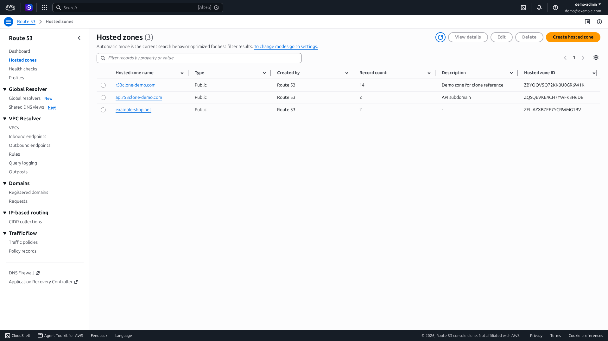
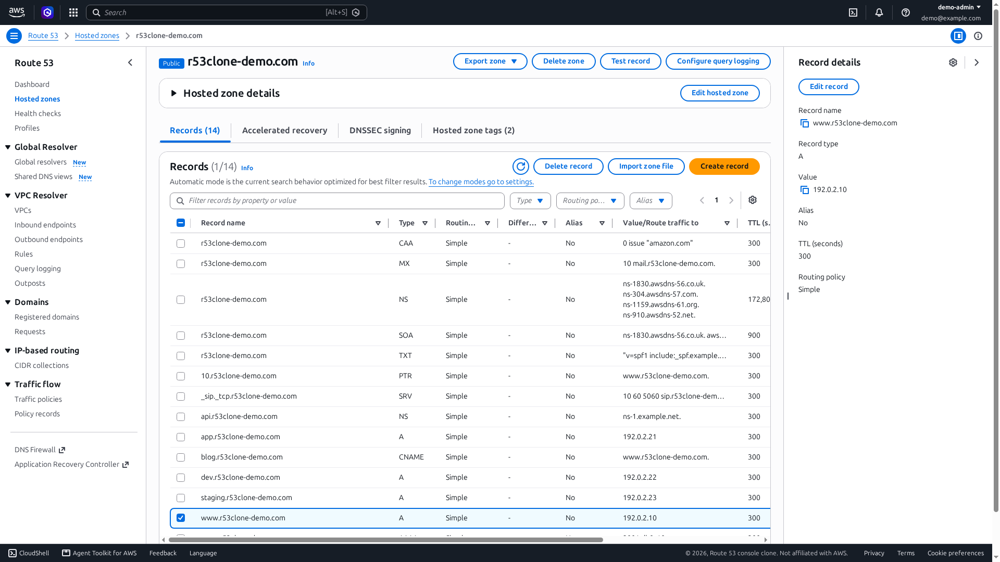
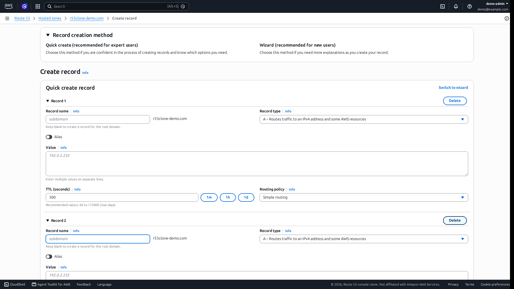
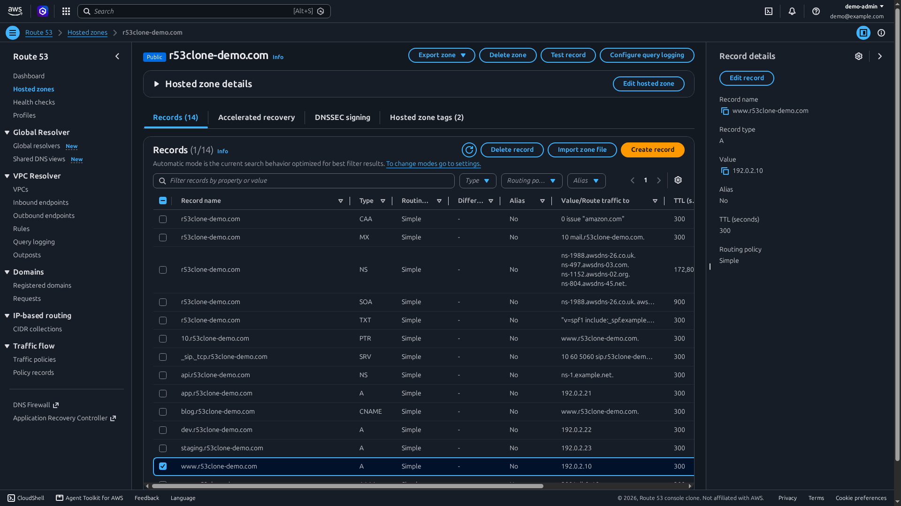
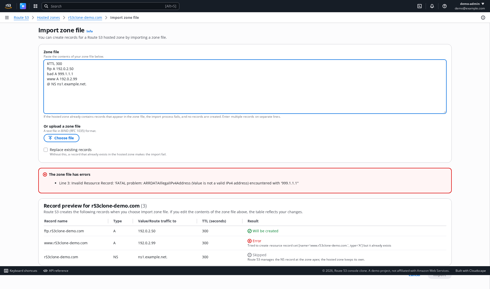
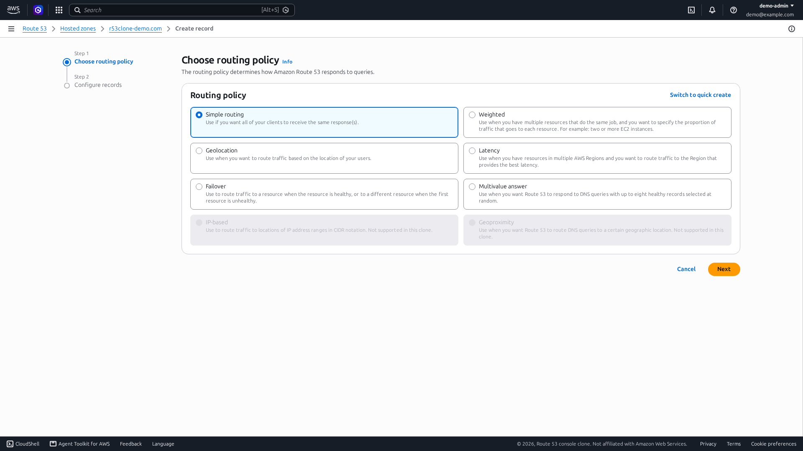
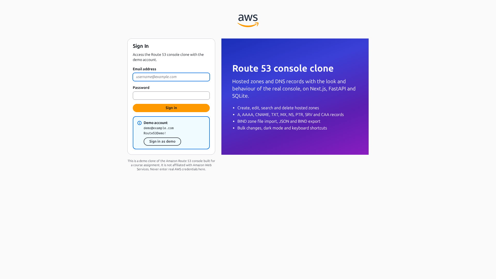
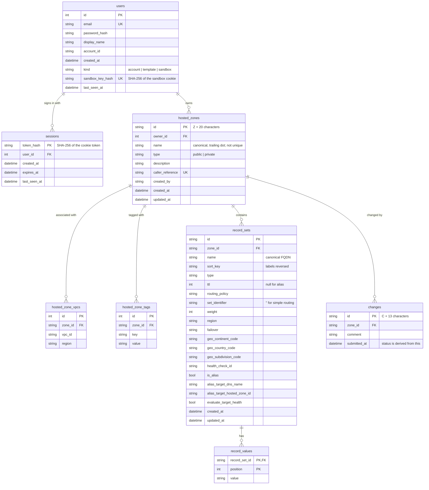

# Route 53 console clone

[](https://github.com/biscuitrescue/aws-route53-console-clone/actions/workflows/ci.yml)

A functional clone of the Amazon Route 53 console: hosted zones and DNS records with full
create, read, update and delete, backed by a FastAPI service and a SQLite database. It
recreates the console's workflows and rules; it does not serve DNS.

| | |
|---|---|
| Frontend | Next.js 16 (App Router, TypeScript), [Cloudscape Design System](https://cloudscape.design), TanStack Query |
| Backend | FastAPI, Pydantic v2, SQLAlchemy 2, Alembic |
| Database | SQLite (WAL, foreign keys enforced) |
| Hosting | One Compute Engine VM on Google Cloud: Caddy, Next.js, FastAPI in Docker Compose |

The UI was built from captures of the real console with the console's own design system,
so layout, wording, motion and keyboard behaviour match it closely. What the console looks
like and how the clone was compared with it is written down in
[docs/ui-spec.md](docs/ui-spec.md) and
[docs/parity/reference-audit.md](docs/parity/reference-audit.md).

| Hosted zones | Records and the record panel |
|---|---|
|  |  |

| Create record | Dark mode |
|---|---|
|  |  |

| Import zone file | Record wizard |
|---|---|
|  |  |

| Sign-in | |
|---|---|
|  | |

**Live demo:** <https://35-208-96-233.sslip.io> (sign in with `demo@example.com` /
`Route53Demo!`, or use the "Sign in with this account" button). API reference:
<https://35-208-96-233.sslip.io/api/docs>.

## Contents

- [Features](#features)
- [Keyboard shortcuts](#keyboard-shortcuts)
- [Setup](#setup)
- [Architecture](#architecture)
- [Database schema](#database-schema)
- [API overview](#api-overview)
- [Visitor sandboxes](#visitor-sandboxes)
- [Security](#security)
- [Deployment on Google Cloud](#deployment-on-google-cloud)
- [Known limitations](#known-limitations)

## Features

| Assignment scope | What is implemented |
|---|---|
| Authentication | Mocked sign-in against a seeded demo account. Opaque session token in an httpOnly cookie, stored hashed, 14-day expiry, survives reloads, browser restarts and server restarts. A route guard sends visitors without a session to sign-in and back to where they were going. Every visitor works in a [private sandbox](#visitor-sandboxes), so nothing one visitor deletes is missing for the next. |
| Hosted zones | List with property filter, sorting, pagination and preferences; details side panel; create (public or private with VPC associations, tags); edit description, tags and VPC associations in one atomic save; delete with typed confirmation and Route 53's "zone must be empty" rule. |
| DNS records | A, AAAA, CNAME, TXT, MX, NS, PTR, SRV, CAA (plus the zone's SOA). Table with free-text and property filters, type / routing policy / alias quick filters, sorting, pagination, preferences; quick create for several records at once, or the two-step wizard (routing policy, then records); edit in the side panel; delete with a confirmation listing the records. Simple, weighted, latency, failover, geolocation and multivalue routing, and alias records. |
| Route 53 experience | The console's frame: global header (services menu, search with live results, CloudShell, notifications, help menu, account menu with Sign out), toolbar with breadcrumbs, side navigation, stacked flash notifications including the in-progress ones, help panel behind every "Info" link, side split panel, footer. Tables, forms, modals, empty and no-match states use the console's wording. Controls that belong to other AWS services say so instead of doing nothing. |
| Route 53 behaviour | Every zone gets an apex NS (TTL 172800, four `awsdns` name servers) and SOA (TTL 900) that cannot be deleted. CNAMEs cannot sit at the apex or share a name with other records. Values are validated per type. Names accept the characters Route 53 lists; `*` is a wildcard only as the whole leftmost label and never for NS records. Routed records need a record ID, cannot mix policies at one name and type, allow one latency record per Region, one geolocation record per location and one primary and one secondary failover record, and share the last TTL given. Duplicate zone names are allowed and get distinct IDs. Error messages use Route 53's wording. Record changes get a change ID whose status goes from `PENDING` to `INSYNC`, as a [simulation](#change-status). |
| Placeholders | Dashboard, Health checks, Profiles, Traffic policies, Resolver and the other navigation entries show a "Coming soon" page inside the full console frame. |
| Bonus: import | BIND zone file import (paste or upload) with a live dry-run preview that reports syntax errors by line and rule violations per record, and an option to replace existing records. |
| Bonus: export | "Export zone" on the zone page downloads a BIND zone file or JSON in the AWS CLI's `list-resource-record-sets` shape. |
| Bonus: bulk operations | Multi-select delete and bulk TTL edit, both through atomic change batches (`CREATE` / `UPSERT` / `DELETE`) modelled on `ChangeResourceRecordSets`; quick create also submits its records as one batch. |
| Bonus: dark mode | Visual mode (browser default, light, dark) in the account menu, as in the console. Light by default; the choice is remembered across visits and applied before first paint. |
| Bonus: keyboard shortcuts | See below. |

## Keyboard shortcuts

Press `?` anywhere in the console for this list, or open it from the help menu in the
top bar. Shortcuts are ignored while typing in a field and while a dialog is open.

| Key | Action |
|---|---|
| `Alt` + `S` | Focus the search field in the top bar (finds hosted zones as you type) |
| `/` | Focus the table filter |
| `c` | Create a hosted zone (zones list) or a record (zone page) |
| `i` | Import a zone file (zone page) |
| `r` | Refresh the table |
| `Delete` | Delete the selected records (zone page) |
| `?` | Show the shortcuts |

Tables are also fully keyboard-navigable (arrow keys move between cells), as in the console.

## Setup

### Prerequisites

- Python 3.12 or newer and [uv](https://docs.astral.sh/uv/)
- Node.js 22.15 or newer and npm

### One command

```bash
./dev.sh
```

It installs what is missing, migrates and seeds the database, and runs the API on
<http://127.0.0.1:8000> and the web app on <http://localhost:3000> until you press Ctrl+C.
The two sections below are the same steps by hand.

### Backend

```bash
cd backend
uv sync                          # create .venv and install dependencies
uv run alembic upgrade head      # create or migrate the SQLite database
uv run python -m app.seed        # demo user and sample zones (safe to run again)
uv run uvicorn --factory app.main:create_app --reload --port 8000
```

The API is at <http://127.0.0.1:8000/api/v1> and its interactive documentation at
<http://127.0.0.1:8000/docs>.

### Frontend

```bash
cd frontend
npm install
npm run dev                      # http://localhost:3000
```

The dev server proxies `/api/*` to the backend, so both must be running.

### Demo credentials

| Email | Password |
|---|---|
| `demo@example.com` | `Route53Demo!` |

These are the local defaults; change them with `R53_DEMO_EMAIL` and `R53_DEMO_PASSWORD`
before the first seed.

### Environment variables

Every variable is optional. Copy `backend/.env.example` to `backend/.env` and
`frontend/.env.example` to `frontend/.env.local` to override the defaults.

| Variable | Default | Purpose |
|---|---|---|
| `R53_ENVIRONMENT` | `development` | `development`, `test` or `production` |
| `R53_DATABASE_URL` | `sqlite:///./data/route53.db` | Location of the SQLite file |
| `R53_SESSION_COOKIE_NAME` | `r53_session` | Name of the session cookie |
| `R53_SESSION_TTL_HOURS` | `336` | Session lifetime (14 days) |
| `R53_COOKIE_SECURE` | `false` | Set to `true` when serving over HTTPS |
| `R53_LOGIN_MAX_FAILURES` | `5` | Failed sign-ins allowed per client address and account within the window; `0` turns the limit off |
| `R53_LOGIN_MAX_FAILURES_PER_CLIENT` | `20` | Failed sign-ins allowed per client address across all accounts |
| `R53_LOGIN_FAILURE_WINDOW_SECONDS` | `300` | Length of that window |
| `R53_TRUSTED_ORIGINS` | `[]` | JSON list of other origins allowed to send state-changing requests; needed only if the frontend is served from a different host than the API |
| `R53_DEMO_EMAIL`, `R53_DEMO_PASSWORD`, `R53_DEMO_DISPLAY_NAME`, `R53_DEMO_ACCOUNT_ID` | see `.env.example` | The seeded demo account |
| `R53_SEED_DEMO_DATA` | `true` | Create the sample zones when they do not exist yet |
| `R53_DEMO_SANDBOX` | `true` | Give each visitor of the demo account a private copy of the sample zones; see [Visitor sandboxes](#visitor-sandboxes) |
| `R53_SANDBOX_IDLE_DAYS`, `R53_SANDBOX_MAX`, `R53_SANDBOX_CREATIONS_PER_HOUR` | `14`, `500`, `60` | When sandboxes are deleted, how many may exist, and how many one address may start per hour |
| `R53_CHANGE_PROPAGATION_SECONDS` | `10` | How long a record change reports `PENDING` before `INSYNC`; see [Change status](#change-status) |
| `R53_MAX_HOSTED_ZONES`, `R53_MAX_RECORDS_PER_ZONE` | `500`, `10000` | Quotas per account and per zone (Route 53's defaults); the live deployment sets 50 and 1000 |
| `BACKEND_URL` (frontend) | `http://127.0.0.1:8000` | Where Next.js proxies `/api/*` (read at build or dev-server start) and where the sign-in page asks for the published credentials (read when the server runs) |

### Tests and checks

```bash
cd backend
uv run pytest                    # 357 tests: domain rules, every route, migrations, seed
uv run ruff check . && uv run ruff format --check .
uv run mypy                      # strict

cd ../frontend
npm run typecheck && npm run lint && npm run format:check
npm run build
npx playwright install chromium   # once
npm run test:e2e                 # needs the backend and frontend running
```

The end-to-end tests (ten, in `frontend/e2e`) drive a real browser through the product:

- `smoke.spec.ts`: sign in through the route guard, create a zone, create one record of
  every type, filter, edit, check that a non-empty zone cannot be deleted, bulk-delete, sign
  out and back in, delete the zone; a session surviving a new browser context; the
  placeholder sections.
- `features.spec.ts`: zone file import (errors by line, preview, import, the all-or-nothing
  rule) and both exports; bulk TTL edit and bulk delete; every keyboard shortcut and the
  global search; dark mode surviving a reload; the header menus; the record wizard; a
  private zone and editing its VPCs and tags. These tests also fail on any browser console
  error or 5xx response.

Each test creates the zones it needs and removes them, so they can run against a shared
deployment: `E2E_BASE_URL=https://... npm run test:e2e`.

Each backend test runs against its own SQLite file created by the real Alembic migration,
so the migration, the constraints and the queries are all exercised.

After changing the API, regenerate the frontend's types with `npm run generate:api`.

### Continuous integration

[`.github/workflows/ci.yml`](.github/workflows/ci.yml) runs on every push to `main` and on
every pull request, so the checks above do not have to be taken on trust. The badge at the
top of this file links to the runs. It has three jobs:

| Job | What it runs |
|---|---|
| Backend | `ruff check`, `ruff format --check`, `mypy` (strict) and the whole `pytest` suite, on the Python version of the production image |
| Frontend | `npm run typecheck`, `npm run lint` and `npm run format:check` |
| End to end | Migrates and seeds a throwaway SQLite database, starts the API, builds the frontend for production and starts it, waits for both to answer their health checks, then runs the Playwright tests in Chromium |

No job needs a secret. Each uploads its results as artifacts: the JUnit report of the
backend tests, and for the end-to-end job the Playwright HTML report, the trace and
screenshot of any failed test, and both server logs. In CI a failed end-to-end test is
retried once and reported as flaky if it then passes; a test that fails twice fails the run.

`npm run start:standalone` is what the workflow uses to serve the production build; it
works locally too, after `npm run build`.

## Architecture


The browser only ever talks to one origin. Next.js serves the pages and proxies `/api/*`
to FastAPI, which owns all business rules and the database.

### Repository layout

```
backend/
  app/
    main.py            application factory, router mounting
    config.py          settings from R53_* environment variables
    db.py              engine with foreign keys and WAL enabled per connection
    errors.py          error types; error_handlers.py renders {code, message, details}
    domain/            pure logic: DNS names, per-type validation, BIND parser, identifiers
    models/            SQLAlchemy 2 typed ORM models
    schemas/           Pydantic request and response models
    repositories/      queries: search, property filters, sorting, pagination
    services/          business rules: auth, zones, records, change batches, import/export
    routers/           thin HTTP layer
    seed.py            idempotent demo data: the demo user and the template's sample zones
  alembic/             migrations
  tests/
frontend/
  app/
    (auth)/signin/     sign-in page, outside the console frame
    (console)/         console pages; their layout holds the header, footer and notifications
  components/
    shell/             console frame: header, footer, page layout, notifications, help
    zones/  records/   pages and their parts
    common/            pieces shared by both
  hooks/               data hooks (TanStack Query), preferences, shortcuts, visual mode
  lib/
    api/               generated OpenAPI types, typed client, error mapping
    *.ts               routes, formatting, record form model, filter translation
  e2e/                 Playwright end-to-end tests
  proxy.ts             redirects visitors without a session to sign-in
dev.sh                 one-command local start
deploy/
  docker-compose.prod.yml, Caddyfile
  gcp/                 setup.sh, deploy.sh, startup.sh, backup.sh
```

### Key decisions

- **Cloudscape for the UI.** The AWS console is built with Cloudscape, AWS's open-source
  design system. Using the same components gives the same layout, tables, filters, modals,
  notifications, focus rings and motion as the real console, instead of an approximation.
  DevTools snapshots of the real console showed it differs from stock Cloudscape in two
  visible ways: orange primary buttons and the Amazon Ember typeface. The theme overrides
  exactly those tokens, in a stylesheet generated at build time so it is part of the first
  paint. Amazon Ember is not licensed for reuse, so it is only named first in the font
  stack; the bundled fallback is Ubuntu Sans, chosen by measuring 107 open fonts against
  text widths recorded from the console (within 1 to 2%).
- **Filtering, sorting and pagination happen in the API.** The tables send the property
  filter's tokens to the backend (`filter=field:operator:value`), so they behave the same
  with 10 records or 10,000.
- **One page layout component.** Every console page renders `ConsolePage`, which owns the
  toolbar, navigation, help panel and split panel, so pages only describe their content.
- **Same-origin API with an httpOnly cookie.** Because Next.js proxies `/api/*`, the session
  cookie is first-party everywhere, JavaScript cannot read it, `SameSite=Lax` blocks
  cross-site requests from carrying it, and no CORS configuration exists to get wrong.
- **Sessions are opaque and stored hashed.** The cookie holds 256 random bits; the database
  holds only their SHA-256, so a leaked database file contains no usable sessions. Passwords
  are hashed with Argon2id (19 MiB, two passes), a setting chosen by measuring it on the
  server; see [docs/performance.md](docs/performance.md).
- **Round trips are spent in parallel.** The live server is a continent away from most of
  its visitors, so a page is as slow as its longest chain of requests. The sign-in page
  arrives with everything it shows, the console's scripts are downloaded while the visitor
  is still signing in, and the data of the next page is requested when its link is
  followed. [docs/performance.md](docs/performance.md) has the measurements.
- **Rules live in services, not routers.** Routers translate HTTP to service calls. The
  domain layer (`app/domain`) has no database or framework imports and is unit-tested
  directly.
- **One code path for record changes.** Single-record endpoints, change batches, the seed
  and zone file import all go through the same validation and conflict checks, so a rule
  cannot be bypassed by choosing a different endpoint. Import's dry run executes the real
  batch and rolls back, so the preview reports exactly what an import would hit.
- **Derived, not duplicated.** A zone's record count is computed by the database on read
  rather than stored, so it cannot drift.
- **A VM instead of Cloud Run.** SQLite needs a local disk with POSIX file locking. Cloud
  Run's filesystem is ephemeral, and its Cloud Storage volume mounts have no file locking,
  so concurrent writes would silently lose data. One small VM with a persistent disk is the
  correct home for a SQLite file.

## Database schema



| Table | Purpose | Constraints and indexes |
|---|---|---|
| `users` | Whoever owns hosted zones: the sign-in account, the template that holds the canonical sample zones, and one row per visitor sandbox. | Unique `email` and `sandbox_key_hash`. `kind` checked against the three kinds. Index `(kind, last_seen_at)` for finding idle sandboxes. `AUTOINCREMENT`, so a deleted sandbox's ID is never reused. |
| `sessions` | Login sessions. | Primary key is the token's hash. Index on `expires_at` (purge) and `user_id`. Cascade on user delete. |
| `hosted_zones` | Hosted zones. | `type` checked against `public`/`private`. Unique `caller_reference`. Indexes on `name` and `owner_id`. `name` is deliberately not unique, as in Route 53. |
| `hosted_zone_vpcs` | VPCs of private zones. | Unique `(zone_id, vpc_id)`. Cascade on zone delete. |
| `hosted_zone_tags` | Zone tags. | Unique `(zone_id, key)`. Cascade on zone delete. |
| `record_sets` | One row per name, type and set identifier. | Unique `(zone_id, name, type, set_identifier)`. Checks on `type`, `routing_policy`, `failover`, TTL range 0 to 2147483647, weight 0 to 255, and alias shape (alias rows have a target and no TTL; others the reverse). Indexes `(zone_id, sort_key, type)` for listing and `(zone_id, type)` for the type filter. Cascade on zone delete. |
| `changes` | One row per accepted record change, for its simulated status. | Index `(zone_id, submitted_at)`. Cascade on zone delete. The status is not stored; it follows from `submitted_at`. |
| `record_values` | The values of a record set, in order. | Primary key `(record_set_id, position)`. Index on `value` for search. Cascade on record set delete. |

Notes:

- **Values are rows, not a JSON column**, so searching by value is a plain join and the
  order the user entered is explicit.
- **`set_identifier` is `''` rather than `NULL` for simple records**, because SQLite treats
  NULLs as distinct in unique indexes and the uniqueness rule must cover simple records.
- **`sort_key`** stores the name with its labels reversed (`com.example.www`), which orders
  records the way Route 53 lists them: the apex first, then each subtree together.
- Timestamps are stored as naive UTC and converted to timezone-aware values in the
  application.
- Every connection runs `PRAGMA foreign_keys=ON` and `PRAGMA journal_mode=WAL`.
- The schema is created by Alembic (`backend/alembic/versions`); a test asserts that the
  migrations and the models never diverge.
- SQLite alters a table by rebuilding it and dropping the old one, and with foreign keys
  enforced that drop cascades into every row referring to the table. Migrations therefore
  run with enforcement off and finish with `PRAGMA foreign_key_check`
  (`backend/alembic/env.py`); a test migrates a populated database up and down and compares
  every row.

## API overview

Base path `/api/v1`. JSON in and out. Interactive documentation is served at `/docs`
(OpenAPI schema at `/api/openapi.json`). Every route except health and login requires the
session cookie.

| Method | Path | Purpose |
|---|---|---|
| `GET` | `/health` | Liveness and database check |
| `POST` | `/auth/login` | Sign in; sets the session cookie |
| `POST` | `/auth/logout` | End the session |
| `GET` | `/auth/me` | The signed-in user |
| `GET` | `/hostedzones` | List zones |
| `POST` | `/hostedzones` | Create a zone (and its apex NS and SOA) |
| `GET` | `/hostedzones/{zone_id}` | Zone details with name servers, VPCs and tags |
| `PATCH` | `/hostedzones/{zone_id}` | Edit the description, tags and VPC associations, all or nothing |
| `DELETE` | `/hostedzones/{zone_id}` | Delete an empty zone |
| `GET` `PUT` | `/hostedzones/{zone_id}/tags` | Read or replace the zone's tags |
| `GET` | `/hostedzones/{zone_id}/records` | List records |
| `POST` | `/hostedzones/{zone_id}/records` | Create a record |
| `GET` `PATCH` `DELETE` | `/hostedzones/{zone_id}/records/{record_id}` | Read, edit or delete a record |
| `POST` | `/hostedzones/{zone_id}/records:batch` | Apply an atomic change batch |
| `GET` | `/hostedzones/{zone_id}/export?format=bind\|json` | Download the zone |
| `POST` | `/hostedzones/{zone_id}/import` | Preview or import a BIND zone file |
| `GET` | `/changes/{change_id}` | Status of a record change: `PENDING`, then `INSYNC` |

### List parameters

Both list endpoints accept:

| Parameter | Meaning |
|---|---|
| `search` | Free text. Zones: name, description, ID. Records: name, values, alias target. |
| `type` | Zones: `public` or `private`. Records: a record type; repeat it for several. |
| `filter` | `field:operator:value`, repeatable. Operators: `eq`, `ne`, `contains`, `not_contains`, `starts_with`, `not_starts_with`, `gt`, `gte`, `lt`, `lte`. |
| `filter_mode` | `and` (default) or `or` |
| `sort`, `order` | Sort field and `asc` or `desc`. The default order is Route 53's: by domain, parent before child. |
| `page`, `page_size` | 1-based page and size (1 to 500, default 50) |

Zone filter fields: `name`, `type`, `description`, `id`, `created_by`, `record_count`,
`accelerated_recovery`. Record filter fields: `name`, `type`, `value`, `ttl`,
`routing_policy`, `differentiator`, `set_identifier`, `alias`, `health_check_id`,
`evaluate_target_health`, `id`. Every record column can also be sorted by.

Responses are paged: `{"items": [...], "total": 33, "page": 1, "page_size": 50, "pages": 1}`.

### Examples

Create a record:

```http
POST /api/v1/hostedzones/Z0123456789ABCDEFGHIJ/records
Content-Type: application/json

{"name": "www", "type": "A", "ttl": 300, "values": ["192.0.2.10", "192.0.2.11"]}
```

```json
{
  "id": "0b0f4c1e-6c1e-4a57-9f0c-5d2f4f6f4b3a",
  "zone_id": "Z0123456789ABCDEFGHIJ",
  "name": "www.example.com.",
  "type": "A",
  "ttl": 300,
  "values": ["192.0.2.10", "192.0.2.11"],
  "routing_policy": "simple",
  "set_identifier": null,
  "weight": null,
  "region": null,
  "failover": null,
  "geolocation": null,
  "health_check_id": null,
  "alias": false,
  "alias_target": null,
  "created_at": "2026-10-09T10:15:00Z",
  "updated_at": "2026-10-09T10:15:00Z"
}
```

Record names may be relative to the zone (`www`), fully qualified, or empty / `@` for the
apex. They are returned in canonical form with a trailing dot.

Apply a change batch. Changes run in order in one transaction; if any is invalid, none is
applied:

```http
POST /api/v1/hostedzones/Z0123456789ABCDEFGHIJ/records:batch
Content-Type: application/json

{
  "comment": "move www behind a CNAME",
  "changes": [
    {"action": "DELETE", "record_set": {"name": "www", "type": "A"}},
    {"action": "CREATE", "record_set": {"name": "www", "type": "CNAME", "ttl": 300, "values": ["lb.example.net"]}}
  ]
}
```

Preview a zone file import (`dry_run` defaults to `true`; send `false` to import):

```http
POST /api/v1/hostedzones/Z0123456789ABCDEFGHIJ/import
Content-Type: application/json

{"content": "$TTL 3600\nwww IN A 192.0.2.10\nmail IN A 999.1.1.1\n"}
```

```json
{
  "dry_run": true,
  "applied": false,
  "summary": {"create": 1, "replace": 0, "skip": 0, "error": 0},
  "record_sets": [
    {"line": 2, "name": "www.example.com.", "type": "A", "ttl": 3600, "values": ["192.0.2.10"], "status": "create", "reason": null}
  ],
  "errors": [
    {"field": null, "index": null, "line": 3, "message": "Invalid Resource Record: 'FATAL problem: ARRDATAIllegalIPv4Address (Value is not a valid IPv4 address) encountered with '999.1.1.1''"}
  ]
}
```

### Change status

Route 53 answers a record change with a change ID whose status is `PENDING` until the
change has reached all of its name servers, then `INSYNC`. The clone reproduces the two
states and nothing more:

- Every accepted record change (single create, edit or delete, a change batch, a zone file
  import) is saved immediately and gets a change ID such as `C2682N5HXP0BZ4`. A batch
  returns it as `id` with `status` and `submitted_at`; an import returns `change_id`; the
  single-record routes return it in the `X-Change-Id` header.
- `GET /changes/{change_id}` reports `PENDING` for `R53_CHANGE_PROPAGATION_SECONDS` (10 by
  default) after the change was saved, and `INSYNC` from then on.
- In the console, the "View status" button of the notification that follows a record
  change shows that status and follows it until it is `INSYNC`.

**The status is simulated.** No DNS is served, so there is nothing to propagate: the
records are final and visible the moment the request returns, and the delay is only a
timer. The table is usable throughout. A rejected change gets no ID, a change can only be
read by the owner of its zone, and changes older than a day are forgotten the next time
their zone changes.

### Errors

Every error has the same body:

```json
{
  "code": "HostedZoneNotEmpty",
  "message": "The specified hosted zone contains non-required resource record sets and so cannot be deleted.",
  "details": []
}
```

`details` lists the individual problems, each with a `message` and, where it applies, the
request `field`, the `index` of the failing change in a batch, or the zone file `line`.

| Status | When | Example codes |
|---|---|---|
| 400 | A Route 53 rule is violated | `InvalidInput`, `InvalidDomainName`, `InvalidChangeBatch`, `InvalidZoneFile` |
| 401 | No session, or it expired | `Unauthorized`, `SessionExpired`, `AuthFailure` |
| 403 | A state-changing request came from a page of another origin | `CrossOriginRequest` |
| 404 | Unknown zone, record or change | `NoSuchHostedZone`, `NoSuchRecordSet`, `NoSuchChange` |
| 409 | The change conflicts with existing data, or two requests raced each other | `RecordSetAlreadyExists`, `RecordSetConflict`, `HostedZoneNotEmpty`, `PriorRequestNotComplete` |
| 422 | The request is malformed | `ValidationError` |
| 429 | Too many failed sign-ins; `Retry-After` says how long to wait | `Throttling` |

## Visitor sandboxes

The live site has one account and its password is printed on the sign-in page, so every
visitor used to edit the same hosted zones: anyone could delete the sample data and leave
an empty console for the next person.

Now signing in to that account opens a **sandbox**: a private copy of the sample zones
that belongs to one browser.

- **How a visitor gets one.** At sign-in the backend looks for the `r53_sandbox` cookie
  (httpOnly, 14 days, stored as a SHA-256 like the session token). If it names a sandbox,
  the session is opened on it, so signing out and in again returns to the same data. If
  not, a sandbox is created and filled, in the same transaction as the session, with a
  copy of the 12 sample zones and their records. Nothing has to be registered.
- **Where the copies come from.** The sample zones belong to a *template* user that has no
  usable password and no session, so it cannot be signed in to or edited. It is seeded
  once, deterministically, from `backend/app/seed.py`. Because the canonical data can
  never be changed, there is nothing to reset and no reset schedule.
- **Isolation is the backend's ownership check.** A sandbox is a row of `users`, and every
  zone query was already filtered by owner, so another visitor's zone ID answers
  `NoSuchHostedZone` on every route: read, edit, delete, records, tags, import, export.
  The frontend is not involved.
- **Cleanup.** When a sandbox is created, sandboxes unused for 14 days are deleted, and so
  are the stalest beyond 500. Their sessions, zones and records go with them through the
  foreign keys. Using a sandbox keeps it alive.
- **Limits.** One client address can start 60 sandboxes an hour. On the live site a
  sandbox holds at most 50 hosted zones of 1,000 records each (`TooManyHostedZones`,
  `LimitsExceeded`), enforced on single creates, change batches and zone file imports.

Verified by `backend/tests/test_sandbox.py` (one visitor deletes everything they have and
the other's zones are unchanged; thirteen requests against a foreign zone ID are refused;
idle and surplus sandboxes are purged with all they own; the template never changes) and
by an end-to-end test that drives two browsers side by side.

What it does not do: a visitor who clears their cookies, or uses another browser, starts
from a fresh copy and cannot get the old one back. `R53_DEMO_SANDBOX=false` restores one
shared set of zones.

## Security

Authentication is mocked, so this is not a claim of production security. What is in place:

- **Session cookie.** `HttpOnly`, `SameSite=Lax`, `Secure` in production, 14-day lifetime.
  The server stores only the SHA-256 of the token.
- **Sign-in throttling.** After 5 failed sign-ins for one account from one client address
  within 5 minutes, or 20 for any accounts from one address, further attempts get `429`
  with a `Retry-After` header until the oldest failure leaves the window. The answer is
  the same whether or not the account exists, a successful sign-in clears the count, and
  the count is per address, so nobody can lock other visitors out of the shared account.
  The address comes from the connection, which uvicorn fills from `X-Forwarded-For` only
  for the proxy it is told to trust; in the deployment that header is written by Caddy,
  which discards whatever the client sent.
- **Cross-origin requests.** `SameSite=Lax` keeps the cookie off requests from other
  *sites*, but the live host is a subdomain of `sslip.io`, which is not on the public
  suffix list, so every other `*.sslip.io` page counts as the same site. The API therefore
  also refuses any `POST`, `PUT`, `PATCH` or `DELETE` that a browser marks as coming from
  another origin (`Sec-Fetch-Site`, with `Origin` compared against the host as the
  fallback for older browsers). Requests carrying neither header are not from a browser
  page and are let through, so scripts and `curl` work. There is no CORS configuration,
  and a JSON body sent as `text/plain` (the one cross-site `POST` that needs no preflight)
  is rejected.
- **Passwords** are hashed with Argon2id; an unknown account takes the same time to
  reject as a wrong password.
- **Response headers** from Caddy: HSTS, `X-Content-Type-Options: nosniff`,
  `X-Frame-Options: DENY`, a strict `Referrer-Policy`.

Known limits:

- The throttle counts in the memory of the one backend process. A restart forgets the
  counts, and with several workers each would count on its own; a shared store such as
  Redis would be the fix, and this deployment has neither several workers nor Redis.
- There is no per-account lockout across addresses, by choice: with a published password
  it would let anyone lock the account for everyone.
- There is no CSRF token. The origin check above covers the same ground for browsers
  that send `Sec-Fetch-Site` or `Origin`, which every current browser does.
- No Content-Security-Policy is set.
- The one account's password is public by design, there is no MFA, and there are no roles.

## Deployment on Google Cloud

The demo runs on a single Compute Engine VM with Docker Compose
(`deploy/docker-compose.prod.yml`):

- **caddy** listens on 80 and 443, obtains a Let's Encrypt certificate automatically and
  forwards to the frontend.
- **frontend** is the Next.js standalone server; it proxies `/api/*` to `http://backend:8000`.
- **backend** runs `alembic upgrade head` and the idempotent seed on start, then uvicorn. It
  has a health check on `/api/v1/health`, and the frontend waits for it.
- The SQLite file is bind-mounted from `/srv/route53/data` on the VM's persistent disk.
- All services restart automatically and rotate their logs (3 files of 10 MB).

No domain is needed: the scripts reserve a static IP and use `<ip-with-dashes>.sslip.io`
as the host name, which resolves to that IP, so Let's Encrypt issues a real certificate.
Set `DOMAIN` to use a domain you own instead.

Images are built by Cloud Build and stored in Artifact Registry, so neither your machine
nor the 1 GB VM has to run the Next.js build.

### Expected cost

| Resource | Free tier | Expected monthly cost |
|---|---|---|
| e2-micro VM in `us-west1`, `us-central1` or `us-east1` | 1 instance per month | $0 |
| 30 GB standard persistent disk | 30 GB-months | $0 |
| Static external IPv4 address, in use | not listed in the free tier | about $3.65 ($0.005 per hour) |
| Artifact Registry | 0.5 GB | $0 while the two images stay under 0.5 GB, then $0.10 per GB |
| Cloud Build | 2,500 build-minutes per month | $0 |
| Cloud Storage backups | 5 GB-months in US regions | $0 |
| Outbound traffic | 1 GB from North America | $0 for a demo |

Roughly **$4 per month**, almost all of it the IP address. Free tier terms change; check
<https://cloud.google.com/free/docs/free-cloud-features> before creating anything. A
reserved address that is not attached to a VM costs more, so release it when you tear the
demo down.

### One-time setup

Requires the [Google Cloud CLI](https://cloud.google.com/sdk/docs/install) and a project
with billing enabled.

```bash
gcloud auth login
gcloud config set project <PROJECT_ID>

PROJECT_ID=<PROJECT_ID> REGION=us-central1 ZONE=us-central1-a ./deploy/gcp/setup.sh
```

`setup.sh` is idempotent and asks before creating each billable resource. It enables the
Compute Engine, Artifact Registry, Cloud Build and IAP APIs, then creates the image
repository, a dedicated service account for the VM (Artifact Registry reader and log
writer only), a backup bucket with a 30-day lifecycle, the static IP, firewall rules, and
a Debian 12 e2-micro VM. The VM's startup script installs Docker and the Compose plugin,
adds 2 GB of swap, prepares `/srv/route53` and schedules the backup.

The firewall admits only ports 80 and 443 from the internet. SSH is reachable only through
Identity-Aware Proxy (`gcloud compute ssh --tunnel-through-iap`).

### Deploy

```bash
PROJECT_ID=<PROJECT_ID> DEMO_PASSWORD='<password for the demo account>' ./deploy/gcp/deploy.sh
```

`deploy.sh` builds both images with Cloud Build (tagged with the git commit), uploads the
Compose file, Caddyfile and environment to the VM, pulls and restarts the stack, and
smoke-tests `https://<site>/api/v1/health`. A full deploy takes about six minutes, most of
it the two image builds. While the backend container restarts (about ten seconds, for the
migration and seed), API calls fail; the data is untouched. Use `BUILD=local` to build and push with your
own Docker, or `BUILD=skip IMAGE_TAG=<tag>` to roll back to an earlier image.

On Windows, run the scripts from Git Bash or WSL.

### Backups

`backup.sh` runs nightly from cron on the VM. It uses SQLite's online backup API
(`sqlite3 .backup`), verifies the snapshot with `PRAGMA integrity_check`, compresses it and
uploads it to the backup bucket. The bucket only ever holds backups; the live database is
never placed on Cloud Storage. Set `ENABLE_BACKUPS=0` when running `setup.sh` to skip this.

### Operations

```bash
# logs
gcloud compute ssh route53-clone --zone us-central1-a --tunnel-through-iap \
  --command 'cd /srv/route53 && sudo docker compose logs --tail 100'

# restart the backend; the data persists because the database is on the VM's disk
gcloud compute ssh route53-clone --zone us-central1-a --tunnel-through-iap \
  --command 'cd /srv/route53 && sudo docker compose restart backend'
```

To tear everything down, delete the VM, the static IP, the firewall rules, the Artifact
Registry repository, the backup bucket and the service account.

## Known limitations

- This is a console clone, not a DNS server: no record is ever served or resolved, and name
  servers, alias targets, VPC IDs and health check IDs are not checked against real AWS
  resources.
- Authentication is mocked: one seeded demo account, no IAM, MFA, sign-up or password reset.
  Each browser that signs in to it gets its own sandbox; the sandbox is tied to a cookie,
  not to a person.
- Routing policies: simple, weighted, latency, failover, geolocation and multivalue answer
  are stored and validated. Geoproximity and IP-based routing are not implemented.
- Record types are the nine in the assignment plus SOA; the console's other types (DS,
  TLSA, SSHFP, HTTPS, SVCB, NAPTR, SPF) are listed but disabled.
- Alias records can point at another record of the same zone by choosing it; any other
  alias target is entered as a DNS name and hosted zone ID, since there are no AWS
  resources to choose from.
- Test record, query logging, DNSSEC signing and accelerated recovery are present in the
  UI and answer "coming soon". Amazon Q, CloudShell and the account pages of the header
  answer "not available in this clone".
- With classic (non-overlay) scrollbars, the development server logs one React hydration
  warning from Cloudscape's table scrollbar, which measures the scrollbar only in the
  browser. Production builds are unaffected.
- Changes take effect immediately. The `PENDING` and `INSYNC` states are a timer, not
  propagation; see [Change status](#change-status).
- SQLite allows one writer at a time, which suits a single-VM demo, not a multi-instance
  deployment.
- Deliberate visual differences from the real console (the fallback typeface, footer
  text, the notice on the sign-in page) are listed with their reasons in
  [docs/ui-spec.md](docs/ui-spec.md#13-deliberate-differences-from-the-real-console).
- The frontend's lint tooling currently reports upstream `npm audit` advisories in
  development-only dependencies; nothing affected ships in the production image.
