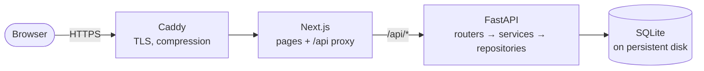
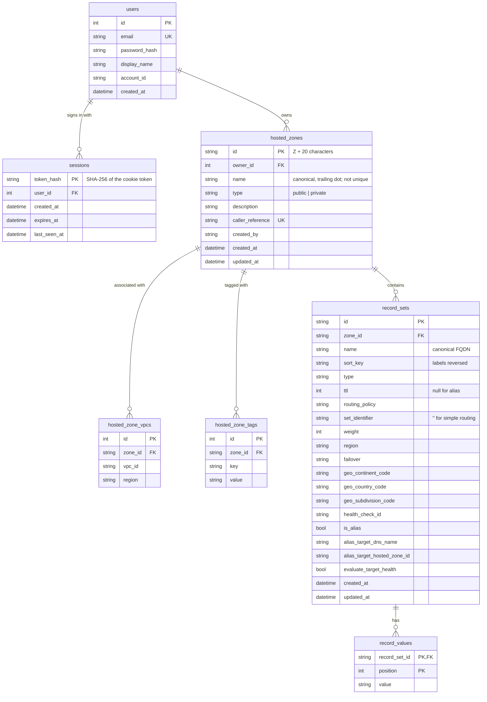

# Route 53 console clone

A functional clone of the Amazon Route 53 console: hosted zones and DNS records with full
create, read, update and delete, backed by a FastAPI service and a SQLite database. It
recreates the console's workflows and rules; it does not serve DNS.

| | |
|---|---|
| Frontend | Next.js 16 (App Router, TypeScript), [Cloudscape Design System](https://cloudscape.design), TanStack Query |
| Backend | FastAPI, Pydantic v2, SQLAlchemy 2, Alembic |
| Database | SQLite (WAL, foreign keys enforced) |
| Hosting | One Compute Engine VM on Google Cloud: Caddy, Next.js, FastAPI in Docker Compose |

> **Status:** the backend, API, deployment tooling and frontend foundation are complete and
> tested. The console pages are built from captures of the real console and are in progress;
> the live demo link and screenshots are added once they are deployed.

## Contents

- [Features](#features)
- [Setup](#setup)
- [Architecture](#architecture)
- [Database schema](#database-schema)
- [API overview](#api-overview)
- [Deployment on Google Cloud](#deployment-on-google-cloud)
- [Known limitations](#known-limitations)

## Features

| Assignment scope | What is implemented |
|---|---|
| Authentication | Mocked sign-in against a seeded demo account. Opaque session token in an httpOnly cookie, stored hashed, 14-day expiry, survives reloads, browser restarts and server restarts. |
| Hosted zones | List with search, property filters, sorting and pagination; create (public or private with VPC associations, tags); edit description; delete with Route 53's "zone must be empty" rule. |
| DNS records | A, AAAA, CNAME, TXT, MX, NS, PTR, SRV, CAA (plus the zone's SOA). List with search, type filter, property filters, sorting, pagination; create, edit, delete. Simple, weighted, latency, failover, geolocation and multivalue routing, and alias records. |
| Route 53 behaviour | Every zone gets an apex NS (TTL 172800, four `awsdns` name servers) and SOA (TTL 900) that cannot be deleted. CNAMEs cannot sit at the apex or share a name with other records. Values are validated per type. Duplicate zone names are allowed and get distinct IDs. Error messages use Route 53's wording. |
| Bonus: import | BIND zone file import with a dry-run preview that reports syntax errors by line and rule violations per record. |
| Bonus: export | Hosted zone export as a BIND zone file or as JSON in the AWS CLI's `list-resource-record-sets` shape. |
| Bonus: bulk operations | Atomic change batches (`CREATE` / `UPSERT` / `DELETE`), modelled on `ChangeResourceRecordSets`. |

## Setup

### Prerequisites

- Python 3.12 or newer and [uv](https://docs.astral.sh/uv/)
- Node.js 22 or newer and npm

### Backend

```bash
cd backend
uv sync                          # create .venv and install dependencies
uv run alembic upgrade head      # create or migrate the SQLite database
uv run python -m app.seed        # demo user and sample zones (safe to run again)
uv run uvicorn --factory app.main:create_app --reload --port 8000
```

The API is at <http://127.0.0.1:8000/api/v1> and its interactive documentation at
<http://127.0.0.1:8000/docs>.

### Frontend

```bash
cd frontend
npm install
npm run dev                      # http://localhost:3000
```

The dev server proxies `/api/*` to the backend, so both must be running.

### Demo credentials

| Email | Password |
|---|---|
| `demo@example.com` | `Route53Demo!` |

These are the local defaults; change them with `R53_DEMO_EMAIL` and `R53_DEMO_PASSWORD`
before the first seed.

### Environment variables

Every variable is optional. Copy `backend/.env.example` to `backend/.env` and
`frontend/.env.example` to `frontend/.env.local` to override the defaults.

| Variable | Default | Purpose |
|---|---|---|
| `R53_ENVIRONMENT` | `development` | `development`, `test` or `production` |
| `R53_DATABASE_URL` | `sqlite:///./data/route53.db` | Location of the SQLite file |
| `R53_SESSION_COOKIE_NAME` | `r53_session` | Name of the session cookie |
| `R53_SESSION_TTL_HOURS` | `336` | Session lifetime (14 days) |
| `R53_COOKIE_SECURE` | `false` | Set to `true` when serving over HTTPS |
| `R53_DEMO_EMAIL`, `R53_DEMO_PASSWORD`, `R53_DEMO_DISPLAY_NAME`, `R53_DEMO_ACCOUNT_ID` | see `.env.example` | The seeded demo account |
| `R53_SEED_DEMO_DATA` | `true` | Create the sample zones when the demo account has none |
| `BACKEND_URL` (frontend) | `http://127.0.0.1:8000` | Where Next.js proxies `/api/*`; read at build or dev-server start |

### Tests and checks

```bash
cd backend
uv run pytest                    # 315 tests: domain rules, every route, migrations, seed
uv run ruff check . && uv run ruff format --check .
uv run mypy                      # strict

cd ../frontend
npm run typecheck && npm run lint && npm run format:check
npm run build
```

Each backend test runs against its own SQLite file created by the real Alembic migration,
so the migration, the constraints and the queries are all exercised.

After changing the API, regenerate the frontend's types with `npm run generate:api`.

## Architecture



The browser only ever talks to one origin. Next.js serves the pages and proxies `/api/*`
to FastAPI, which owns all business rules and the database.

### Repository layout

```
backend/
  app/
    main.py            application factory, router mounting
    config.py          settings from R53_* environment variables
    db.py              engine with foreign keys and WAL enabled per connection
    errors.py          error types; error_handlers.py renders {code, message, details}
    domain/            pure logic: DNS names, per-type validation, BIND parser, identifiers
    models/            SQLAlchemy 2 typed ORM models
    schemas/           Pydantic request and response models
    repositories/      queries: search, property filters, sorting, pagination
    services/          business rules: auth, zones, records, change batches, import/export
    routers/           thin HTTP layer
    seed.py            idempotent demo data
  alembic/             migrations
  tests/
frontend/
  app/                 routes (App Router)
  lib/api/             generated OpenAPI types, typed client, error mapping
  proxy.ts             redirects visitors without a session to sign-in
deploy/
  docker-compose.prod.yml, Caddyfile
  gcp/                 setup.sh, deploy.sh, startup.sh, backup.sh
```

### Key decisions

- **Cloudscape for the UI.** The AWS console is built with Cloudscape, AWS's open-source
  design system. Using the same components gives the same layout, tables, filters, modals,
  notifications, focus rings and motion as the real console, instead of an approximation.
- **Same-origin API with an httpOnly cookie.** Because Next.js proxies `/api/*`, the session
  cookie is first-party everywhere, JavaScript cannot read it, `SameSite=Lax` blocks
  cross-site requests from carrying it, and no CORS configuration exists to get wrong.
- **Sessions are opaque and stored hashed.** The cookie holds 256 random bits; the database
  holds only their SHA-256, so a leaked database file contains no usable sessions. Passwords
  are hashed with Argon2.
- **Rules live in services, not routers.** Routers translate HTTP to service calls. The
  domain layer (`app/domain`) has no database or framework imports and is unit-tested
  directly.
- **One code path for record changes.** Single-record endpoints, change batches, the seed
  and zone file import all go through the same validation and conflict checks, so a rule
  cannot be bypassed by choosing a different endpoint. Import's dry run executes the real
  batch and rolls back, so the preview reports exactly what an import would hit.
- **Derived, not duplicated.** A zone's record count is computed by the database on read
  rather than stored, so it cannot drift.
- **A VM instead of Cloud Run.** SQLite needs a local disk with POSIX file locking. Cloud
  Run's filesystem is ephemeral, and its Cloud Storage volume mounts have no file locking,
  so concurrent writes would silently lose data. One small VM with a persistent disk is the
  correct home for a SQLite file.

## Database schema



| Table | Purpose | Constraints and indexes |
|---|---|---|
| `users` | Mock accounts. | Unique `email`. |
| `sessions` | Login sessions. | Primary key is the token's hash. Index on `expires_at` (purge) and `user_id`. Cascade on user delete. |
| `hosted_zones` | Hosted zones. | `type` checked against `public`/`private`. Unique `caller_reference`. Indexes on `name` and `owner_id`. `name` is deliberately not unique, as in Route 53. |
| `hosted_zone_vpcs` | VPCs of private zones. | Unique `(zone_id, vpc_id)`. Cascade on zone delete. |
| `hosted_zone_tags` | Zone tags. | Unique `(zone_id, key)`. Cascade on zone delete. |
| `record_sets` | One row per name, type and set identifier. | Unique `(zone_id, name, type, set_identifier)`. Checks on `type`, `routing_policy`, `failover`, TTL range 0 to 2147483647, weight 0 to 255, and alias shape (alias rows have a target and no TTL; others the reverse). Indexes `(zone_id, sort_key, type)` for listing and `(zone_id, type)` for the type filter. Cascade on zone delete. |
| `record_values` | The values of a record set, in order. | Primary key `(record_set_id, position)`. Index on `value` for search. Cascade on record set delete. |

Notes:

- **Values are rows, not a JSON column**, so searching by value is a plain join and the
  order the user entered is explicit.
- **`set_identifier` is `''` rather than `NULL` for simple records**, because SQLite treats
  NULLs as distinct in unique indexes and the uniqueness rule must cover simple records.
- **`sort_key`** stores the name with its labels reversed (`com.example.www`), which orders
  records the way Route 53 lists them: the apex first, then each subtree together.
- Timestamps are stored as naive UTC and converted to timezone-aware values in the
  application.
- Every connection runs `PRAGMA foreign_keys=ON` and `PRAGMA journal_mode=WAL`.
- The schema is created by Alembic (`backend/alembic/versions`); a test asserts that the
  migrations and the models never diverge.

## API overview

Base path `/api/v1`. JSON in and out. Interactive documentation is served at `/docs`
(OpenAPI schema at `/api/openapi.json`). Every route except health and login requires the
session cookie.

| Method | Path | Purpose |
|---|---|---|
| `GET` | `/health` | Liveness and database check |
| `POST` | `/auth/login` | Sign in; sets the session cookie |
| `POST` | `/auth/logout` | End the session |
| `GET` | `/auth/me` | The signed-in user |
| `GET` | `/hostedzones` | List zones |
| `POST` | `/hostedzones` | Create a zone (and its apex NS and SOA) |
| `GET` | `/hostedzones/{zone_id}` | Zone details with name servers, VPCs and tags |
| `PATCH` | `/hostedzones/{zone_id}` | Edit the description |
| `DELETE` | `/hostedzones/{zone_id}` | Delete an empty zone |
| `GET` `PUT` | `/hostedzones/{zone_id}/tags` | Read or replace the zone's tags |
| `GET` | `/hostedzones/{zone_id}/records` | List records |
| `POST` | `/hostedzones/{zone_id}/records` | Create a record |
| `GET` `PATCH` `DELETE` | `/hostedzones/{zone_id}/records/{record_id}` | Read, edit or delete a record |
| `POST` | `/hostedzones/{zone_id}/records:batch` | Apply an atomic change batch |
| `GET` | `/hostedzones/{zone_id}/export?format=bind\|json` | Download the zone |
| `POST` | `/hostedzones/{zone_id}/import` | Preview or import a BIND zone file |

### List parameters

Both list endpoints accept:

| Parameter | Meaning |
|---|---|
| `search` | Free text. Zones: name, description, ID. Records: name, values, alias target. |
| `type` | Zones: `public` or `private`. Records: a record type; repeat it for several. |
| `filter` | `field:operator:value`, repeatable. Operators: `eq`, `ne`, `contains`, `not_contains`, `starts_with`, `not_starts_with`, `gt`, `gte`, `lt`, `lte`. |
| `filter_mode` | `and` (default) or `or` |
| `sort`, `order` | Sort field and `asc` or `desc` |
| `page`, `page_size` | 1-based page and size (1 to 500, default 50) |

Zone filter fields: `name`, `type`, `description`, `id`, `created_by`, `record_count`.
Record filter fields: `name`, `type`, `value`, `ttl`, `routing_policy`, `set_identifier`,
`alias`, `id`.

Responses are paged: `{"items": [...], "total": 33, "page": 1, "page_size": 50, "pages": 1}`.

### Examples

Create a record:

```http
POST /api/v1/hostedzones/Z0123456789ABCDEFGHIJ/records
Content-Type: application/json

{"name": "www", "type": "A", "ttl": 300, "values": ["192.0.2.10", "192.0.2.11"]}
```

```json
{
  "id": "0b0f4c1e-6c1e-4a57-9f0c-5d2f4f6f4b3a",
  "zone_id": "Z0123456789ABCDEFGHIJ",
  "name": "www.example.com.",
  "type": "A",
  "ttl": 300,
  "values": ["192.0.2.10", "192.0.2.11"],
  "routing_policy": "simple",
  "set_identifier": null,
  "weight": null,
  "region": null,
  "failover": null,
  "geolocation": null,
  "health_check_id": null,
  "alias": false,
  "alias_target": null,
  "created_at": "2026-10-09T10:15:00Z",
  "updated_at": "2026-10-09T10:15:00Z"
}
```

Record names may be relative to the zone (`www`), fully qualified, or empty / `@` for the
apex. They are returned in canonical form with a trailing dot.

Apply a change batch. Changes run in order in one transaction; if any is invalid, none is
applied:

```http
POST /api/v1/hostedzones/Z0123456789ABCDEFGHIJ/records:batch
Content-Type: application/json

{
  "comment": "move www behind a CNAME",
  "changes": [
    {"action": "DELETE", "record_set": {"name": "www", "type": "A"}},
    {"action": "CREATE", "record_set": {"name": "www", "type": "CNAME", "ttl": 300, "values": ["lb.example.net"]}}
  ]
}
```

Preview a zone file import (`dry_run` defaults to `true`; send `false` to import):

```http
POST /api/v1/hostedzones/Z0123456789ABCDEFGHIJ/import
Content-Type: application/json

{"content": "$TTL 3600\nwww IN A 192.0.2.10\nmail IN A 999.1.1.1\n"}
```

```json
{
  "dry_run": true,
  "applied": false,
  "summary": {"create": 1, "replace": 0, "skip": 0, "error": 0},
  "record_sets": [
    {"line": 2, "name": "www.example.com.", "type": "A", "ttl": 3600, "values": ["192.0.2.10"], "status": "create", "reason": null}
  ],
  "errors": [
    {"field": null, "index": null, "line": 3, "message": "Invalid Resource Record: 'FATAL problem: ARRDATAIllegalIPv4Address (Value is not a valid IPv4 address) encountered with '999.1.1.1''"}
  ]
}
```

### Errors

Every error has the same body:

```json
{
  "code": "HostedZoneNotEmpty",
  "message": "The specified hosted zone contains non-required resource record sets and so cannot be deleted.",
  "details": []
}
```

`details` lists the individual problems, each with a `message` and, where it applies, the
request `field`, the `index` of the failing change in a batch, or the zone file `line`.

| Status | When | Example codes |
|---|---|---|
| 400 | A Route 53 rule is violated | `InvalidInput`, `InvalidDomainName`, `InvalidChangeBatch`, `InvalidZoneFile` |
| 401 | No session, or it expired | `Unauthorized`, `SessionExpired`, `AuthFailure` |
| 404 | Unknown zone or record | `NoSuchHostedZone`, `NoSuchRecordSet` |
| 409 | The change conflicts with existing data | `RecordSetAlreadyExists`, `RecordSetConflict`, `HostedZoneNotEmpty` |
| 422 | The request is malformed | `ValidationError` |

## Deployment on Google Cloud

The demo runs on a single Compute Engine VM with Docker Compose
(`deploy/docker-compose.prod.yml`):

- **caddy** listens on 80 and 443, obtains a Let's Encrypt certificate automatically and
  forwards to the frontend.
- **frontend** is the Next.js standalone server; it proxies `/api/*` to `http://backend:8000`.
- **backend** runs `alembic upgrade head` and the idempotent seed on start, then uvicorn. It
  has a health check on `/api/v1/health`, and the frontend waits for it.
- The SQLite file is bind-mounted from `/srv/route53/data` on the VM's persistent disk.
- All services restart automatically and rotate their logs (3 files of 10 MB).

No domain is needed: the scripts reserve a static IP and use `<ip-with-dashes>.sslip.io`
as the host name, which resolves to that IP, so Let's Encrypt issues a real certificate.
Set `DOMAIN` to use a domain you own instead.

Images are built by Cloud Build and stored in Artifact Registry, so neither your machine
nor the 1 GB VM has to run the Next.js build.

### Expected cost

| Resource | Free tier | Expected monthly cost |
|---|---|---|
| e2-micro VM in `us-west1`, `us-central1` or `us-east1` | 1 instance per month | $0 |
| 30 GB standard persistent disk | 30 GB-months | $0 |
| Static external IPv4 address, in use | not listed in the free tier | about $3.65 ($0.005 per hour) |
| Artifact Registry | 0.5 GB | $0 while the two images stay under 0.5 GB, then $0.10 per GB |
| Cloud Build | 2,500 build-minutes per month | $0 |
| Cloud Storage backups | 5 GB-months in US regions | $0 |
| Outbound traffic | 1 GB from North America | $0 for a demo |

Roughly **$4 per month**, almost all of it the IP address. Free tier terms change; check
<https://cloud.google.com/free/docs/free-cloud-features> before creating anything. A
reserved address that is not attached to a VM costs more, so release it when you tear the
demo down.

### One-time setup

Requires the [Google Cloud CLI](https://cloud.google.com/sdk/docs/install) and a project
with billing enabled.

```bash
gcloud auth login
gcloud config set project <PROJECT_ID>

PROJECT_ID=<PROJECT_ID> REGION=us-central1 ZONE=us-central1-a ./deploy/gcp/setup.sh
```

`setup.sh` is idempotent and asks before creating each billable resource. It enables the
Compute Engine, Artifact Registry, Cloud Build and IAP APIs, then creates the image
repository, a dedicated service account for the VM (Artifact Registry reader and log
writer only), a backup bucket with a 30-day lifecycle, the static IP, firewall rules, and
a Debian 12 e2-micro VM. The VM's startup script installs Docker and the Compose plugin,
adds 2 GB of swap, prepares `/srv/route53` and schedules the backup.

The firewall admits only ports 80 and 443 from the internet. SSH is reachable only through
Identity-Aware Proxy (`gcloud compute ssh --tunnel-through-iap`).

### Deploy

```bash
PROJECT_ID=<PROJECT_ID> DEMO_PASSWORD='<password for the demo account>' ./deploy/gcp/deploy.sh
```

`deploy.sh` builds both images with Cloud Build (tagged with the git commit), uploads the
Compose file, Caddyfile and environment to the VM, pulls and restarts the stack, and
smoke-tests `https://<site>/api/v1/health`. Use `BUILD=local` to build and push with your
own Docker, or `BUILD=skip IMAGE_TAG=<tag>` to roll back to an earlier image.

On Windows, run the scripts from Git Bash or WSL.

### Backups

`backup.sh` runs nightly from cron on the VM. It uses SQLite's online backup API
(`sqlite3 .backup`), verifies the snapshot with `PRAGMA integrity_check`, compresses it and
uploads it to the backup bucket. The bucket only ever holds backups; the live database is
never placed on Cloud Storage. Set `ENABLE_BACKUPS=0` when running `setup.sh` to skip this.

### Operations

```bash
# logs
gcloud compute ssh route53-clone --zone us-central1-a --tunnel-through-iap \
  --command 'cd /srv/route53 && sudo docker compose logs --tail 100'

# restart the backend; the data persists because the database is on the VM's disk
gcloud compute ssh route53-clone --zone us-central1-a --tunnel-through-iap \
  --command 'cd /srv/route53 && sudo docker compose restart backend'
```

To tear everything down, delete the VM, the static IP, the firewall rules, the Artifact
Registry repository, the backup bucket and the service account.

## Known limitations

- This is a console clone, not a DNS server: no record is ever served or resolved, and name
  servers, alias targets, VPC IDs and health check IDs are not checked against real AWS
  resources.
- Authentication is mocked: one seeded demo account, no IAM, MFA, sign-up or password reset.
- Routing policies: simple, weighted, latency, failover, geolocation and multivalue answer
  are stored and validated. Geoproximity and IP-based routing are not implemented.
- Changes take effect immediately; there is no `PENDING` propagation state.
- SQLite allows one writer at a time, which suits a single-VM demo, not a multi-instance
  deployment.
- The frontend's lint tooling currently reports upstream `npm audit` advisories in
  development-only dependencies; nothing affected ships in the production image.
